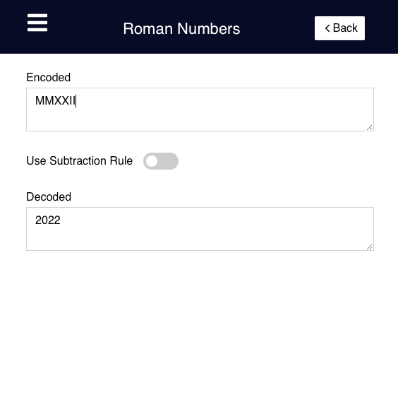

# Getting Started with Geo Caching Companion

This project is licensed under [MIT](https://opensource.org/licenses/MIT).

## About this project

The goal of the project was to develop a usable app that provides help in solving multi-caches.   
For this purpose, the app offers many possibilities such as algorithms and other functions from science and technology.

## Features:

- Cesar Algorithm
- Alphabet Values
- Fox Code
- Altbash
- Base
- Hash
- Roman Numbers
- Cipher Disk
- Quadratic Equation
- Range
- Numeric Base Converter
- Complex Numbers

## Current ToDo:

Please visit [Issues](https://github.com/ElDiabolus/geo-caching-companion/issues).  
Help us improve the app by adding issues or solving issues by creating pull requests!

## Development

For Development information please read [DEVELOP.MD](/DEVELOP.md).
